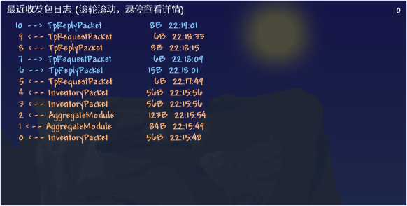
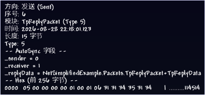
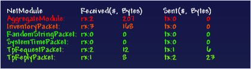

# 调试

NetSimplified 内置调试模块，模组只需要启用该模块并调用 UI 绘制即可

首先，在 `Mod.Load()` 方法中注册 NetModuleLoader 以启用网络诊断（数据监视器），并注册服务器诊断指令

```csharp
public override void Load() {
    AddContent<NetModuleLoader>();
    AddContent<NetSimplifiedDiagnosticsCommand>();
}
```

NetSimplified 库本身不提供 UI 开关控制与绘制时机，而是由使用库的 Mod 自行处理。详情参考 [NetSimplifiedExample 中的 ExampleDiagnosticsUISystem 类](../NetSimplifiedExample/UI/ExampleDiagnosticsUISystem.cs)，这里的代码实现了调试 UI 的惰性初始化，以及按下 F9 和 F10 来开关两个调试 UI 的功能

## [ModuleLogViewer](../src/Diagnostics/ModuleLogViewer.cs)



ModuleLogViewer 记录了该客户端最近的收发包情况，最新的在顶端。界面右上角的数字（图中为 `0`）为客户端的玩家ID，即 `Main.myPlayer` 的数值

保留最多 256 条信息，当信息超过 256 条时，最早的信息会被丢弃

将鼠标悬停在某个包上，可以查看其详细信息



详细信息中包含方向、模块名、传输时间、长度等基础信息，`Type` 为该 NetModule 的内部编号，是加载模组时自动赋值的

如果该 NetModule 包含使用了 AutoSync 特性的字段，则也会显示这些字段的值。其内部实现为调用 `ToString()` 方法，因此可以通过覆写自定义类的 `ToString()` 方法来自定义显示的内容

## [ModuleTrafficMonitor](../src/Diagnostics/ModuleTrafficMonitor.cs)



ModuleTrafficMonitor 与原版通过 F8 呼出的网络状态调试界面完全一致。显示该客户端自进入服务器以来每个 NetModule 的收/发包总个数以及数据总量

## [指令查询：NetSimplifiedDiagnosticsCommand](../src/Diagnostics/NetSimplifiedDiagnosticsCommand.cs)

服务器端不显示 UI，而是采用指令来进行相关信息的查询（在客户端中也可以输入指令）。相关指令用法如下：

| 指令 | 简介 |
| - | - |
| `nsdiag traffic` | 各模块收发流量总表 |
| `nsdiag log [count]` | 最近收发包记录（默认 10，上限 256） |
| `nsdiag detail <seq>` | 某条记录的详细信息 |
| `nsdiag reset` | 重置所有数据 |

这部分上手一用就知道了，应该还是很明了的，我就懒得写了

[返回 README](../README.md)
